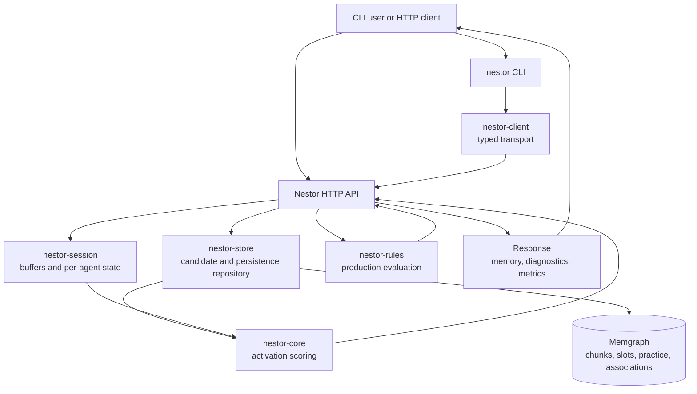
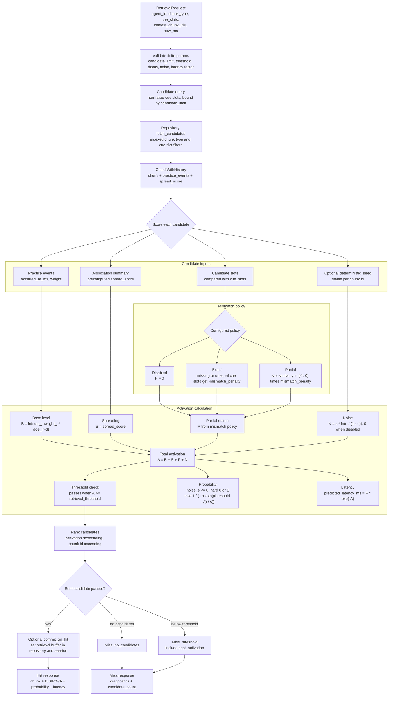

# Architecture Notes

Nestor uses a hybrid ACT-R design with Rust-owned scoring and Memgraph-backed
persistence.

## Ownership Boundary

Rust owns:

- current goal, retrieval, imaginal, and task buffers;
- per-agent session serialization;
- base-level activation, spreading activation, mismatch, noise, thresholding, and latency;
- production matching, conflict resolution, and utility updates.

Memgraph owns:

- durable chunks and slot/value graph;
- association edges used as spreading-activation inputs;
- practice history and optional audit events;
- production rule metadata and utility summaries;
- schema introspection and operational metrics.

## Runtime Profiles

The Rust service loads `RuntimeConfig` from environment variables, constructs a
repository, and validates the config before binding the API listener.
`NESTOR_REPOSITORY` defaults to `memgraph`; `memory` is reserved for explicit
test or local fixture runs. `NESTOR_PROFILE` accepts `development`, `staging`, or
`production`:

- `development` binds the API to `127.0.0.1:8080`, uses local Bolt at
  `bolt://127.0.0.1:7687`, and leaves Memgraph credentials optional for local
  development.
- `staging` binds on `0.0.0.0:8080`, uses a private `bolt+s://` Memgraph URI,
  enables TLS, and requires a credential source.
- `production` uses the staging hardening defaults, disables deterministic
  runtime seeding, rejects loopback Memgraph URIs, and requires TLS plus a
  credential source.

Common overrides are `NESTOR_API_BIND_ADDR`, `NESTOR_MEMGRAPH_URI`,
`NESTOR_MEMGRAPH_USER`, `NESTOR_MEMGRAPH_MAX_CONNECTIONS`,
`NESTOR_CANDIDATE_LIMIT`, `NESTOR_RETRIEVAL_THRESHOLD`, and
`NESTOR_DETERMINISTIC_SEED`. TLS is controlled with
`NESTOR_MEMGRAPH_TLS_ENABLED`, `NESTOR_MEMGRAPH_TLS_CA_FILE`, and
`NESTOR_MEMGRAPH_TLS_SERVER_NAME`.

`/readyz` runs a real repository health check. With the Memgraph backend, this is
a Bolt query against Memgraph; with the explicit in-memory backend it reports the
test repository as ready.

## Observability

The Rust API exposes Prometheus text exposition at `/metrics`. The service
metrics include retrieval hits and misses, last retrieval latency, last
candidate count, last activation-compute duration, session-lock contention, and
write conflicts. Prometheus scrapes the API through the `nestor` job in
`config/prometheus/prometheus.yml`.

Memgraph is started with `--metrics-format=OpenMetrics` and
`--metrics-port=9091`. Prometheus scrapes it inside the Compose network at
`memgraph:9091`, while the host mapping is bound to `127.0.0.1:9091` for local
development only. The Bolt port follows the same local-only host binding.

## TLS And Credentials

Do not commit Memgraph passwords, client certificates, private keys, generated
CA material, or local `.env` files. Runtime credentials should be supplied by
the deployment environment through one of these sources:

- `NESTOR_MEMGRAPH_PASSWORD`: a secret value provided by the process environment.
- `NESTOR_MEMGRAPH_PASSWORD_ENV`: the name of an environment variable that will
  contain the secret.
- `NESTOR_MEMGRAPH_PASSWORD_FILE`: a path mounted from a secret manager, such as
  `/run/secrets/memgraph-password`.

Production deployments should use a private `bolt+s://` Memgraph endpoint,
enable `NESTOR_MEMGRAPH_TLS_ENABLED=true`, set
`NESTOR_MEMGRAPH_TLS_SERVER_NAME` to the certificate identity, and mount any CA
bundle through `NESTOR_MEMGRAPH_TLS_CA_FILE`.

## Retrieval Flow

1. Normalize symbolic cues in Rust.
2. Fetch a bounded candidate set from Memgraph using indexed labels/properties.
3. Hydrate practice history and association summaries.
4. Compute activation in Rust.
5. Threshold and tie-break ranked candidates.
6. Commit the retrieval buffer on a hit when requested, then return hit or miss
   diagnostics.

This deliberately avoids graph-only ACT-R scoring. Dynamic activation math and
deterministic tests are the reasons to keep scoring in Rust.

## Memory System Flow

The CLI and HTTP API share the same memory path. The CLI owns terminal
interaction and output rendering, while the API owns request handling and calls
the Rust memory modules.

## Retrieval Scoring Internals

Nestor uses Memgraph to keep candidate generation bounded and durable, then
scores every candidate in Rust so retrieval remains deterministic, testable, and
explainable.

The response preserves the component breakdown as `base_level`, `spreading`,
`partial_match`, `noise`, `activation`, `retrieval_probability`, and
`predicted_latency_ms`. This makes CLI and API results mechanically checkable
without requiring callers to infer why a memory was retrieved or missed.
