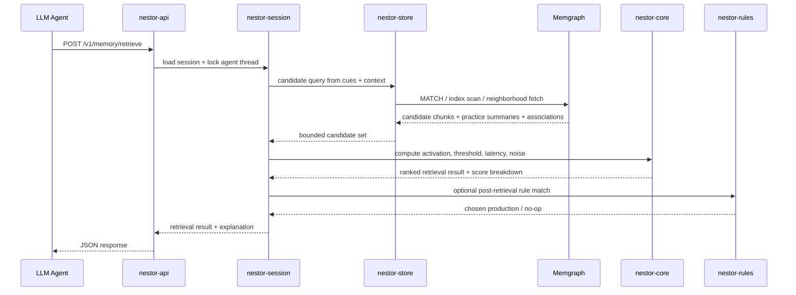

# ACT-R Memory System for LLM Agents in Rust and Memgraph

## Executive summary

This report recommends a **hybrid ACT-R implementation** in which **Rust** owns the hot cognitive path—buffers, activation math, retrieval arbitration, production matching, utility updates, and per-agent concurrency—while **Memgraph** owns durable long-term memory: persisted chunks, slot/value relations, association edges, production-rule metadata, usage history, and audit trails. That split follows both ACT-R’s architecture, where buffers and procedural selection are centralized while memory retrieval is driven by chunk structure and sub-symbolic activation, and Memgraph’s strengths in indexed symbolic lookup, transactional graph persistence, and queryable schema metadata. It also aligns with the strongest current Rust/Memgraph integration path: an async Tokio service using a Bolt-compatible driver such as `neo4rs`, with Memgraph indexes, constraints, WAL, snapshots, and Prometheus/OpenMetrics monitoring turned on. [^actr-integrated-theory][^memgraph-indexes][^memgraph-transactions][^memgraph-rust]

The recommended implementation is **not** “graph-only ACT-R.” Instead, Memgraph should provide **candidate generation and persistence**, while Rust computes the ACT-R retrieval score for a bounded candidate set using recency/frequency, spreading activation, optional partial matching, thresholding, latency estimation, and controlled noise. This is the critical engineering decision: ACT-R’s retrieval equations are dynamic and per-request, while Memgraph excels at constraining search space with labels, properties, relationships, and sorted result sets. Keeping scoring in Rust makes the system easier to test deterministically, easier to evolve, and more faithful to ACT-R’s procedural cycle and per-agent buffer semantics. [^actr-integrated-theory][^memgraph-indexes]

For the second deliverable, the report defines a **Codex-compatible goal system** as a repository convention rather than as a native first-class OpenAI product object. In the official Codex documentation reviewed here, “Goal” appears explicitly as one of the four recommended prompt fields—**Goal, Context, Constraints, Done when**—and Codex guidance emphasizes planning, milestones, repeatable workflows, AGENTS.md instructions, machine-readable output, and CI-triggered automation. Accordingly, this report defines each “Codex Goal” as an atomic, verifiable engineering work package with a prompt, expected artifacts, an output schema, and explicit verification steps. [^openai-codex]

## Scope and assumptions

This design assumes that the **LLM agent framework is unspecified**, so the Nestor memory service is exposed as a **framework-neutral HTTP API** and can be called by a ReAct-style agent, a planner/executor loop, or a tool-using assistant. It also assumes **no high availability requirement**, per the user’s instruction, so the target deployment is **one Rust memory service plus one Memgraph instance** with persistent local storage and ordinary CI/CD, not clustering. The system is designed for a working set large enough that in-memory-only storage is undesirable, but small enough that candidate retrieval remains bounded through symbolic filtering and indexing.

The report also assumes that the implementation should remain **cognitively interpretable**. That means chunks remain symbolic records, production rules remain inspectable, and activation components remain decomposable into base-level, spread, mismatch, and noise contributions rather than being collapsed into an opaque embedding-only score. Embeddings may be added later as an auxiliary source of association or candidate expansion, but they are not the primary retrieval mechanism in the version proposed here.

The practical engineering target is a **single-writer ACT-R session per agent thread**. This mirrors ACT-R’s serial bottlenecks: buffer contents are limited, and only one production is selected in a cycle, even though module internals can proceed asynchronously. ACT-R’s canonical cycle discussion uses a ~50 ms minimum cognitive cycle, one chunk per buffer, and one production selection per cycle; those design facts justify serializing buffer mutation per agent session while still allowing many sessions to run concurrently on Tokio. [^actr-integrated-theory][^rust-crates]

## Deliverable A engineering document

The architecture should be implemented as a **Cargo workspace** with at least six crates:

| Crate | Responsibility | Why it exists |
|---|---|---|
| `nestor-core` | chunk types, slot values, activation math, decay, noise, latency, mismatch, spread | keeps ACT-R equations pure and unit-testable |
| `nestor-session` | buffers, session state machine, production cycle, per-agent actor/lock | preserves ACT-R serial semantics |
| `nestor-rules` | production rule DSL, matching, conflict resolution, utility updates | separates symbolic procedures from storage and transport |
| `nestor-store` | Memgraph repositories, Cypher builders, migrations/bootstrap, cache invalidation | isolates graph persistence concerns |
| `nestor-api` | Axum handlers, DTOs, auth, request validation, tracing context | framework-neutral HTTP interface |
| `nestor-ops` | metrics, health checks, config, deployment helpers, benchmark adapters | keeps runtime and CI concerns out of core logic |

That modularization is a direct engineering translation of ACT-R’s modular architecture: buffers and production selection stay in the central runtime, while declarative memory remains a specialized module accessed through retrieval requests. It also fits the Rust ecosystem well: Tokio provides the async runtime, Axum provides ergonomic HTTP routing and optional SSE/WebSocket support, `thiserror` provides structured error types, `neo4rs` provides an async pooled Bolt client, and Criterion plus testcontainers support benchmark and integration-test workflows. [^actr-integrated-theory][^rust-crates][^memgraph-rust][^neo4rs][^testcontainers][^criterion]

The preferred runtime topology is shown below.

```mermaid
flowchart LR
    A[LLM Agent Orchestrator] --> B[nestor-api]
    B --> C[nestor-session]
    C --> D[nestor-rules]
    C --> E[nestor-core]
    C --> F[nestor-store]
    F --> G[(Memgraph)]
    C --> H[(In-process caches)]
    B --> I[/metrics]
    I --> J[Prometheus]
```

The most important ownership boundary is this:

- **Rust owns**: current goal buffer, retrieval buffer, imaginal/task buffers, session locks, activation score assembly, noise injection, production matching, utility updates, and the final retrieval/rule choice.
- **Memgraph owns**: chunk persistence, slot/value graph, association graph, usage events or compressed practice history, rule metadata, indexable retrieval cues, audit history, and schema introspection.
- **Caches own** only derived hot data: canonicalized chunk DTOs, recent association neighborhoods, and optionally precomputed practice summaries.

The following mapping should be treated as the canonical handoff table for a coding agent. It synthesizes ACT-R’s modules, buffers, and sub-symbolic memory components with Memgraph’s labels, constraints, indexes, and transaction model. [^actr-integrated-theory][^memgraph-indexes][^memgraph-transactions][^memgraph-rust]

| ACT-R concept | Rust module | Memgraph representation | Persistence rule |
|---|---|---|---|
| Chunk | `nestor_core::chunk` | `(:Chunk {chunk_id, tenant_id, chunk_type, created_at, updated_at, slot_hash, retrieval_count, last_access_at, base_bias})` | durable |
| Chunk slot | `nestor_core::slot` | `(c:Chunk)-[:HAS_SLOT {key, value_type}]->(v:SlotValue)` | durable |
| Slot value symbol | `nestor_core::symbol` | `(:SlotValue {tenant_id, key, value_norm, value_hash})` | durable |
| Declarative memory | `nestor_store::declarative_repo` | entire `Chunk/SlotValue/ASSOCIATED/Practice*` graph | durable |
| Goal buffer | `nestor_session::buffers::goal` | optional audit snapshots only | hot in memory |
| Retrieval buffer | `nestor_session::buffers::retrieval` | optional audit snapshots only | hot in memory |
| Imaginal/task buffer | `nestor_session::buffers::*` | optional audit snapshots only | hot in memory |
| Base-level activation | `nestor_core::activation::base_level` | recent timestamps + compressed practice bins on chunk or related nodes | durable inputs, computed in Rust |
| Spreading activation | `nestor_core::activation::spread` | `(:Chunk)-[:ASSOCIATED {strength, source, fan}]->(:Chunk)` and slot-value neighborhoods | durable inputs, computed in Rust |
| Noise | `nestor_core::activation::noise` | none, except audit seed/log if needed | computed in Rust |
| Partial matching | `nestor_core::activation::mismatch` | slot/value graph plus optional similarity tables | computed in Rust |
| Production rule | `nestor_rules::rule` | `(:ProductionRule {rule_id, name, enabled, utility, avg_reward, success_count, failure_count, version})` | durable metadata |
| Procedural memory | `nestor_rules::engine` | rule nodes + optional audit edges | hot execution, durable stats |
| Production utility | `nestor_rules::utility` | `utility`, reward history summaries, counters on `ProductionRule` | durable inputs, computed in Rust |
| Buffer snapshot/audit | `nestor_ops::audit` | `(:BufferSnapshot)` or `(:Episode)-[:HAS_SNAPSHOT]->(:BufferSnapshot)` | append-only |

A typical retrieval cycle should look like this.



The main architectural alternatives and trade-offs are below. These choices are partly driven by ACT-R theory and partly by Memgraph’s indexing, constraints, and transaction behavior. [^actr-integrated-theory][^memgraph-indexes][^memgraph-transactions][^memgraph-rust]

| Decision | Option | Benefits | Costs | Recommendation |
|---|---|---|---|---|
| Memory location | in-memory only | simplest, fastest | poor durability, hard restart semantics, weak auditability | reject |
|  | graph-only scoring in DB | centralized | hard to test noise/latency math, awkward decay logic | reject |
|  | **hybrid Rust + Memgraph** | ACT-R fidelity, durability, inspectability | more moving parts | **choose** |
| Practice history | full event nodes | exact replay | storage growth, expensive scoring | use only for audit/debug |
|  | recent list + bins | bounded storage, near-exact scoring | approximation for old history | **choose** |
| Buffer persistence | fully durable hot buffers | recovery visibility | violates simplicity, extra contention | avoid except snapshots |
|  | **in-memory + audit snapshots** | fast, ACT-R-like | warm restart only | **choose** |
| Association maintenance | DB triggers | automatic, close to data | operational opacity, async trigger complexity | use sparingly |
|  | **app-managed writes/jobs** | explicit logic, easier tests | more code | **choose** |
| Consistency | write-behind eventual | throughput | stale reads, awkward rule utility semantics | avoid for core path |
|  | **request-scoped transactions + per-agent lock** | predictable | less parallelism per session | **choose** |

## Deliverable A data model and algorithms

### Memgraph schema and indexes

The minimum Memgraph schema should include `Chunk`, `SlotValue`, `ProductionRule`, and one compressed practice-history structure. Memgraph does **not** create indexes automatically, label-property indexes do **not** imply label indexes, and uniqueness constraints do **not** create indexes, so schema bootstrap must create both constraints and the exact indexes the retrieval path needs. Composite indexes follow a leftmost-prefix rule, can include nested properties, and descending indexes can eliminate sort work for “top-N newest/highest” queries. [^memgraph-indexes][^memgraph-constraints]

Recommended bootstrap:

```cypher
CREATE CONSTRAINT ON (c:Chunk) ASSERT c.chunk_id IS UNIQUE;
CREATE CONSTRAINT ON (c:Chunk) ASSERT EXISTS (c.tenant_id);
CREATE CONSTRAINT ON (c:Chunk) ASSERT EXISTS (c.chunk_type);
CREATE CONSTRAINT ON (c:Chunk) ASSERT c.retrieval_count IS TYPED INTEGER;

CREATE CONSTRAINT ON (v:SlotValue) ASSERT v.tenant_id, v.key, v.value_hash IS UNIQUE;
CREATE CONSTRAINT ON (r:ProductionRule) ASSERT r.rule_id IS UNIQUE;

CREATE INDEX ON :Chunk(tenant_id, chunk_type);
CREATE INDEX ON :Chunk(tenant_id, slot_hash);
CREATE INDEX ON :Chunk(last_access_at) WITH CONFIG {"order": "DESC"};
CREATE INDEX ON :SlotValue(tenant_id, key, value_hash);
CREATE INDEX ON :ProductionRule(enabled, utility) WITH CONFIG {"order": "DESC"};
CREATE EDGE INDEX ON :ASSOCIATED(strength);
```

A durable chunk should be stored in a **canonical symbolic form**, not as arbitrary JSON blobs alone. A practical representation is:

```cypher
MERGE (c:Chunk {chunk_id: $chunk_id})
SET c.tenant_id = $tenant_id,
    c.chunk_type = $chunk_type,
    c.created_at = datetime($created_at),
    c.updated_at = datetime($updated_at),
    c.slot_hash = $slot_hash,
    c.retrieval_count = $retrieval_count,
    c.last_access_at = datetime($last_access_at),
    c.base_bias = $base_bias
WITH c
UNWIND $slots AS s
MERGE (v:SlotValue {tenant_id: $tenant_id, key: s.key, value_hash: s.value_hash})
SET v.value_norm = s.value_norm
MERGE (c)-[:HAS_SLOT {key: s.key, value_type: s.value_type}]->(v);
```

This representation is intentionally denormalized enough for efficient lookup, but still graph-native enough to support spreading activation through shared values and explicit associations.

### Practice history and activation inputs

ACT-R’s tutorial material makes three implementation facts non-negotiable: retrieval is activation-based, activation drives both retrieval probability and latency, retrieval depends on recency and frequency through base-level learning, context can add spreading activation, partial matching can explain commission errors, and noise is a normal part of model behavior. The tutorial also exposes practical default values such as `:bll ≈ 0.5` and the latency form `F * e^-A`; the integrated-theory paper grounds the broader architecture of buffers and serial production selection. [^actr-integrated-theory][^actr-schooler][^actr-outsider]

Because exact replay of an unbounded practice log is operationally unattractive, the recommended design is:

| History strategy | Stored on chunk | Used for scoring | Recommendation |
|---|---|---|---|
| recent exact events | `recent_practice_ts: [i64]` capped to 64 | exact contribution for newest uses | yes |
| older compressed bins | related `(:PracticeBin {bucket_start, count})` nodes or a compact map | approximate contribution for older uses | yes |
| full audit log | optional `(:PracticeEvent)` append-only nodes | debugging, offline evaluation, migration validation | optional |

This yields an engineering implementation that remains cognitively legible while staying bounded in space and predictable in throughput.

### Retrieval algorithm

The retrieval algorithm should run in five explicit phases:

1. **Cue normalization** in Rust.
2. **Candidate generation** in Memgraph using indexed slot/value filters and optional association neighborhood expansion.
3. **Activation scoring** in Rust.
4. **Thresholding and tie-breaking** in Rust.
5. **Buffer commit and usage update** in Rust plus a Memgraph write transaction.

The candidate query should stay symbolic and bounded. Example:

```cypher
UNWIND $cue_slots AS cue
MATCH (v:SlotValue {tenant_id: $tenant_id, key: cue.key, value_hash: cue.value_hash})<-[:HAS_SLOT]-(c:Chunk)
WHERE c.chunk_type IN $candidate_types
WITH c, count(*) AS cue_matches
OPTIONAL MATCH (ctx:Chunk {chunk_id: $context_chunk_id})-[a:ASSOCIATED]->(c)
WITH c, cue_matches, coalesce(max(a.strength), 0.0) AS assoc_boost
ORDER BY cue_matches DESC, assoc_boost DESC, c.last_access_at DESC
LIMIT $candidate_limit
RETURN c.chunk_id, c.chunk_type, c.retrieval_count, c.last_access_at, c.base_bias;
```

The Rust scorer should then assemble a practical ACT-R-inspired score:

$$
A(c) = B(c) + S(c \mid \text{context}) + P(c \mid \text{cue}) + \epsilon
$$

Where:

- `B(c)` is the base-level component from recent exact uses plus older compressed bins.
- `S(c|context)` is spreading activation from goal-buffer and other configured source buffers.
- `P(c|cue)` is an optional mismatch penalty or bonus from partial matching.
- `ε` is seeded logistic or Gaussian-like noise, disabled in deterministic test mode.

A retrieval should succeed only if `A(c) >= retrieval_threshold`; otherwise the system returns an omission. Retrieval latency should be derived from ACT-R’s latency guidance, so the service returns both `activation` and `predicted_latency_ms` as explainable outputs. [^actr-integrated-theory]

Rust pseudo-code:

```rust
pub async fn retrieve(req: RetrieveRequest, ctx: &SessionCtx) -> Result<RetrieveResponse, MemoryError> {
    let _guard = ctx.agent_lock.acquire().await?;

    let cues = normalize_cues(&req.cues)?;
    let candidates = ctx.store.fetch_candidates(&req.tenant_id, &cues, &req.context).await?;

    let scored: Vec<ScoredChunk> = candidates
        .into_iter()
        .map(|cand| {
            let base = ctx.activation.base_level(&cand.practice_summary, req.now_ms);
            let spread = ctx.activation.spread(&cand, &req.context);
            let mismatch = ctx.activation.partial_match(&cand, &cues);
            let noise = ctx.activation.noise(req.seed, cand.chunk_id);
            let activation = base + spread + mismatch + noise;
            let latency_ms = ctx.activation.latency_ms(activation);
            ScoredChunk { cand, base, spread, mismatch, noise, activation, latency_ms }
        })
        .filter(|s| s.activation >= req.retrieval_threshold)
        .max_by(score_then_tiebreak);

    match scored {
        Some(best) => {
            ctx.buffers.set_retrieval(best.cand.chunk_id.clone())?;
            ctx.store.record_successful_retrieval(&best, req.now_ms).await?;
            Ok(RetrieveResponse::hit(best))
        }
        None => {
            ctx.store.record_failed_retrieval(&req, req.now_ms).await?;
            Ok(RetrieveResponse::miss())
        }
    }
}
```

The production system should be modeled as **symbolic rules plus learned utility**, not as free-form LLM prompts. ACT-R utility learning is commonly expressed as a difference-learning update over experienced reward, so the implementation should keep a per-rule utility, counts, and recent reward summary. Conflict resolution can therefore sort by:

1. explicit enablement and preconditions,
2. rule match specificity,
3. learned utility,
4. optional recency / cooldown penalties.

The rule metadata belongs in Memgraph for inspection and versioning; the actual rule engine belongs in Rust for speed and testability. [^memgraph-indexes][^memgraph-rust]

### API surface

The API should be narrow and explicit:

| Endpoint | Purpose | Notes |
|---|---|---|
| `POST /v1/memory/chunks` | create or upsert chunk | idempotent by `chunk_id` |
| `POST /v1/memory/retrieve` | ACT-R retrieval | returns score breakdown and latency estimate |
| `POST /v1/memory/practice` | record chunk use | updates recent practice history |
| `POST /v1/memory/associate` | add/update association | explicit spread graph maintenance |
| `POST /v1/rules/evaluate` | evaluate production candidates | optional combined retrieve+fire mode |
| `GET /v1/chunks/{id}` | inspect chunk | for debugging and tools |
| `GET /healthz`, `GET /readyz` | liveness/readiness | operational |
| `GET /metrics` | Prometheus scrape | operational |

Recommended retrieval response:

```json
{
  "status": "hit",
  "chunk_id": "2cf7c1f4-4eb9-4c7a-a570-6d03a4a7c1f4",
  "activation": 1.42,
  "predicted_latency_ms": 121,
  "components": {
    "base_level": 0.93,
    "spreading": 0.41,
    "partial_match": 0.18,
    "noise": -0.10
  },
  "rule_candidates": [
    {"rule_id": "answer-from-episodic", "utility": 0.81}
  ]
}
```

## Deliverable A operations and quality

### Concurrency and consistency

Use **Tokio** as the runtime and implement **per-agent session serialization** with either an actor mailbox or an `Arc<Mutex<SessionState>>` plus a bounded semaphore. Tokio is specifically designed for many concurrent I/O-bound tasks and provides the standard async building blocks needed for this shape of service. Memgraph’s default isolation level is **snapshot isolation**, which is the right default for this design: it gives consistent reads inside a transaction and prevents conflicting concurrent updates from silently committing. `neo4rs` already exposes transactions and configurable connection-pool sizing, so the Memory service should use one shared graph client and short-lived request-scoped transactions. [^rust-crates][^memgraph-transactions][^neo4rs]

The consistency model should be:

- **Strong within an agent session**: only one cognitive step mutates that session’s buffers at a time.
- **Transactional for Memgraph writes**: chunk upserts, retrieval-count increments, and rule utility updates happen in a single transaction when they must be causally coupled.
- **Eventually consistent for secondary analytics**: audit expansion, compaction of practice bins, and optional association reweighting can run in background jobs.

Triggers are useful but should remain secondary. Memgraph supports `BEFORE COMMIT` and asynchronous `AFTER COMMIT` triggers, and they are persisted across restarts; however, for a cognitively interpretable ACT-R service, application-managed updates are easier to reason about and easier to test than hidden trigger behavior. Use triggers only for narrowly scoped audit enrichment if needed. [^memgraph-triggers]

### Testing strategy

The test pyramid should be:

| Layer | What to test | Tooling |
|---|---|---|
| unit | activation math, thresholding, latency, noise determinism, rule matching | `cargo test` |
| contract | DTO validation, API schema, error mapping | `cargo test` + snapshots |
| integration | Memgraph schema bootstrap, Cypher repos, tx semantics | testcontainers + Memgraph |
| system | end-to-end encode/retrieve/fire scenarios | docker compose in CI |
| performance | retrieval p50/p95, write rate, cache hit rate | Criterion + load scripts |

Use **deterministic seeds** for all tests that touch noise; a `noise_mode = deterministic(seed)` flag should make activation scores exactly reproducible in CI. Use **golden fixtures** for benchmark chunk graphs, such as “episodic memory with repeated use,” “fan effect neighborhood,” and “partial match commission error.” Criterion is appropriate because it stores statistical run information and can detect performance regressions; testcontainers is appropriate because it creates Docker-backed integration-test dependencies from Rust. [^rust-crates][^testcontainers][^criterion]

### Performance targets and caching

The following are **proposed engineering targets**, not claims about an existing system:

| Path | Target |
|---|---|
| `POST /v1/memory/retrieve` p50 | under 60 ms |
| `POST /v1/memory/retrieve` p95 | under 150 ms |
| `POST /v1/memory/chunks` p95 | under 100 ms |
| candidate set after Memgraph query | ≤ 200 chunks |
| session lock hold time p95 | under 40 ms |
| cache hit rate for chunk metadata | > 85% in steady state |
| benchmark regression gate | fail CI on > 15% slowdown |

The cache plan should be conservative:

- **L1 per-process LRU** for chunk metadata and recent association neighborhoods.
- **No cache for buffer truth**; buffers live in the authoritative session state.
- **No cache for write ordering**; writes stay transactional.
- **Optional negative cache** for repeated failed retrieval cue patterns over short TTLs.

### Security, deployment, CI/CD, and monitoring

For the database connection, enable Bolt TLS using `--bolt-cert-file` and `--bolt-key-file`; Memgraph supports runtime TLS certificate reload for new connections via `RELOAD BOLT_SERVER TLS`. If Memgraph Enterprise is available, use roles and least privilege; otherwise, place Memgraph on a private network segment and keep authentication at the service edge. Memgraph’s auth documentation also recommends treating the default `memgraph` database as the administrative system database in multi-tenant environments and restricting privileged access to it. [^memgraph-ssl][^memgraph-auth][^memgraph-roles]

For durability, keep WAL and snapshots enabled. In Memgraph’s default in-memory transactional mode, WAL is enabled by default and snapshots are required alongside it; recovery prefers the fastest valid method, using snapshots and replaying newer WAL entries when needed. That is sufficient for the non-HA deployment in scope here. Schema introspection via `SHOW SCHEMA INFO` is useful in CI and diagnostics, but it requires `--schema-info-enabled=true` and has a measurable runtime cost, so enable it in development and staging by default and make it configurable for production. [^memgraph-durability][^memgraph-transactions][^memgraph-indexes]

For observability, expose `/metrics` and configure Memgraph for **OpenMetrics**, not the deprecated JSON metrics endpoint. OpenMetrics supports direct Prometheus scraping and per-database labels; key metrics include vertex count, edge count, memory usage, rolled-back transactions, and query execution latency histograms. On the Rust side, expose counters for retrieval hits/misses, rule fires, threshold misses, lock contention, cache hits, candidate counts, and Memgraph transaction retries. [^memgraph-monitoring][^memgraph-transactions]

For transport and runtime packaging, use:

- **Docker Compose** for local development: `memory-service`, `memgraph`, `prometheus`, `grafana`.
- **GitHub Actions** for CI: `cargo fmt --check`, `cargo clippy -- -D warnings`, unit tests, integration tests with Memgraph, benchmark smoke, container build, and deployment artifact publication.
- **Repo-local `AGENTS.md`** so Codex and future coding agents know the build, test, lint, and verification commands for this project. OpenAI’s guidance is to keep AGENTS.md focused on build/test commands, review expectations, conventions, and “what done means.” [^openai-codex]

## Deliverable B Codex goals model

The official Codex materials reviewed for this report do **not** describe a native first-class artifact called a “Goal” in the sense of a separate server-side object. What the docs do provide is a highly consistent workflow model:

- prompts should state **Goal, Context, Constraints, Done when**;
- difficult tasks should start with a **plan**;
- plans should be broken into **milestones**;
- Codex can be driven by **AGENTS.md** and repository-local conventions;
- non-interactive runs can emit **JSON Lines** and **schema-constrained outputs**. [^openai-codex]

Accordingly, the right way to implement “Codex Goals” for this project is as a **repository convention**. Each goal should live under `.codex/goals/<nn>-<slug>/` and contain:

- `prompt.md`
- `output.schema.json`
- `verify.sh`
- `artifacts.txt`
- `goal.yaml` with dependency metadata
- optional `fixtures/` and `expected/`

Recommended `goal.yaml` shape:

```yaml
id: G05
name: retrieval-pipeline
depends_on: [G03, G04]
complexity: M
entrypoint: .codex/goals/G05-retrieval-pipeline/prompt.md
output_schema: .codex/goals/G05-retrieval-pipeline/output.schema.json
verify: .codex/goals/G05-retrieval-pipeline/verify.sh
artifacts:
  - crates/nestor-store/src/retrieval.rs
  - crates/nestor-core/src/activation.rs
  - tests/integration/retrieval_pipeline.rs
```

This convention maps cleanly onto current Codex capabilities. Plan mode can be used before implementation. Milestones can be delegated one by one. `codex exec --json` can stream machine-readable execution events, and `--output-schema` can force a stable final summary for local review. [^openai-codex]

If future CI-based agent runs are reconsidered, treat them as a separate security review. Do not expose `OPENAI_API_KEY` or `CODEX_API_KEY` broadly in CI jobs that execute repository-controlled code. [^openai-codex]

## Deliverable B numbered Codex build plan

The dependency graph for the goals is:

| Goal | Depends on |
|---|---|
| G01 | — |
| G02 | G01 |
| G03 | G01 |
| G04 | G01, G02 |
| G05 | G03, G04 |
| G06 | G03 |
| G07 | G03, G06 |
| G08 | G05, G06, G07 |
| G09 | G03, G04, G05, G06, G07, G08 |
| G10 | G02, G08, G09 |
| G11 | G08, G09, G10 |

### 1. G01 repository scaffold and agent contract

**Complexity:** S

**Inputs:** this engineering report

**Outputs:** Cargo workspace, crate skeletons, `rust-toolchain.toml`, `Makefile`, `.editorconfig`, `.gitignore`, `AGENTS.md`, `.codex/goals/` scaffold

**Example Codex prompt:**
```text
Goal: Scaffold the ACT-R memory system repository as a Cargo workspace.
Context: Create crates nestor-core, nestor-session, nestor-rules, nestor-store, nestor-api, nestor-ops.
Constraints: Rust stable, no business logic yet, no HA, include AGENTS.md with build/test/lint commands, keep modules minimal but compilable.
Done when: cargo check passes, AGENTS.md exists, .codex/goals directory exists with a reusable template.
```

**Acceptance criteria:** `cargo check` passes; every crate builds; `AGENTS.md` lists canonical commands; repository contains `.codex/goals/template/`.

**Verification:** `cargo check && test -f AGENTS.md && test -d .codex/goals/template`

**CI integration:** run on every PR; block merges if the workspace does not compile.

### 2. G02 local runtime and Memgraph bootstrap

**Complexity:** S

**Inputs:** G01 workspace

**Outputs:** `docker-compose.yml`, Memgraph config, bootstrap Cypher, local run docs

**Example Codex prompt:**
```text
Goal: Add a local Memgraph development stack for the Nestor memory project.
Context: Use Docker Compose. Include Memgraph with persistent volumes and a bootstrap step for constraints and indexes.
Constraints: No HA, expose Bolt and metrics ports, keep startup deterministic.
Done when: docker compose up -d starts Memgraph, bootstrap Cypher runs successfully, and a health check confirms the DB is ready.
```

**Acceptance criteria:** Memgraph starts locally; bootstrap creates constraints and indexes; README documents startup and teardown.

**Verification:** `docker compose up -d && ./scripts/wait-for-memgraph.sh && ./scripts/bootstrap-memgraph.sh`

**CI integration:** nightly smoke test or PR job behind a service-container stage.

### 3. G03 core ACT-R domain and math

**Complexity:** M

**Inputs:** G01

**Outputs:** chunk/slot domain types, activation components, thresholding, latency estimation, seeded noise, rule utility math

**Example Codex prompt for code and unit tests:**
```text
Goal: Implement the ACT-R core math and domain model.
Context: Add chunk, slot, activation_component, scored_chunk, retrieval_threshold, latency_estimator, noise source, and utility update functions in nestor-core.
Constraints: Pure functions only; deterministic mode for tests; document formulas in rustdoc.
Done when: cargo test -p nestor-core passes and includes unit tests for base-level scoring, spreading activation composition, threshold misses, latency behavior, and deterministic noise.
```

**Acceptance criteria:** pure functions with no DB dependency; deterministic tests pass; public APIs documented.

**Verification:** `cargo test -p nestor-core`

**CI integration:** mandatory PR gate.

### 4. G04 Memgraph schema and repository layer

**Complexity:** M

**Inputs:** G02, G03

**Outputs:** schema bootstrap code, repository traits, Memgraph adapter, query fixtures

**Example Codex prompt:**
```text
Goal: Implement the Memgraph persistence layer for chunks, slot values, associations, and production rules.
Context: Use an async Bolt-compatible Rust driver. Add repository traits plus a Memgraph implementation in nestor-store.
Constraints: Use explicit transactions where needed; separate read and write methods; make Cypher strings testable.
Done when: integration tests can upsert a chunk, fetch it back, persist associations, and enforce uniqueness constraints.
```

**Acceptance criteria:** repository tests pass against a real Memgraph instance; migrations/bootstrap idempotent.

**Verification:** `cargo test -p nestor-store -- --nocapture`

**CI integration:** service-container or testcontainers-backed integration job.

### 5. G05 retrieval candidate generation pipeline

**Complexity:** M

**Inputs:** G03, G04

**Outputs:** cue normalization, candidate queries, result hydration, activation scoring pipeline

**Example Codex prompt:**
```text
Goal: Build the retrieval pipeline from normalized cues to a ranked retrieval result.
Context: Use Memgraph to fetch bounded symbolic candidates, then score them in Rust with base-level, spreading activation, mismatch, and optional noise.
Constraints: Candidate set must be bounded; return score breakdowns; keep scoring deterministic under test seeds.
Done when: integration tests prove exact-match retrieval, threshold miss behavior, and context-sensitive re-ranking.
```

**Acceptance criteria:** retrieval returns stable ranked results; misses are explicit; score breakdown is present.

**Verification:** `cargo test retrieval_pipeline -- --nocapture`

**CI integration:** must run on PRs touching `nestor-core` or `nestor-store`.

### 6. G06 session state and ACT-R buffer semantics

**Complexity:** M

**Inputs:** G03

**Outputs:** per-agent session state, buffer structs, lock/actor model, retrieval-buffer commit logic

**Example Codex prompt:**
```text
Goal: Implement per-agent session state with ACT-R-like buffer semantics.
Context: Goal buffer, retrieval buffer, and imaginal/task buffer should live in memory and be mutated serially per agent session.
Constraints: One cognitive step at a time per agent; expose deterministic APIs for tests; no database writes from buffer structs directly.
Done when: unit tests demonstrate serialized mutation, buffer replacement, and retrieval commit behavior under concurrent requests.
```

**Acceptance criteria:** concurrent tests show no torn buffer state; one-step-at-a-time semantics enforced.

**Verification:** `cargo test -p nestor-session`

**CI integration:** PR gate.

### 7. G07 production-rule engine and utility learning

**Complexity:** M

**Inputs:** G03, G06

**Outputs:** rule DSL, matcher, conflict resolution, utility updates, rule audit records

**Example Codex prompt:**
```text
Goal: Implement the ACT-R procedural memory engine.
Context: Rules should match against session buffers and optional retrieved chunks, then be ranked by specificity and learned utility.
Constraints: Store rule metadata separately from execution state; design for inspectability; support enable/disable and version fields.
Done when: tests cover rule matching, conflict resolution, reward updates, and a no-match path.
```

**Acceptance criteria:** rules are deterministic in deterministic mode; utility updates are persisted correctly through the repository interface.

**Verification:** `cargo test -p nestor-rules`

**CI integration:** PR gate when rules or session code changes.

### 8. G08 HTTP API and end-to-end service wiring

**Complexity:** M

**Inputs:** G05, G06, G07

**Outputs:** Axum service, DTOs, error mapping, health/readiness/metrics endpoints

**Example Codex prompt:**
```text
Goal: Expose the memory system as an HTTP API.
Context: Add endpoints for chunk upsert, retrieval, practice recording, association updates, and rule evaluation.
Constraints: Validate inputs, return JSON only, map domain errors to stable HTTP responses, include /healthz, /readyz, and /metrics.
Done when: end-to-end API tests pass and example curl requests in docs are correct.
```

**Acceptance criteria:** API tests pass; OpenAPI or JSON-schema-like docs generated if chosen.

**Verification:** `cargo test -p nestor-api && cargo run -p nestor-api`

**CI integration:** PR gate; optional container image build thereafter.

### 9. G09 test harnesses and benchmark suite

**Complexity:** M

**Inputs:** G03–G08

**Outputs:** unit-test matrix, integration fixtures, end-to-end scenarios, Criterion benchmarks, testcontainers harness

**Example Codex prompt for integration tests:**
```text
Goal: Add comprehensive tests and reproducible benchmarks for the Nestor memory service.
Context: Use testcontainers or Docker-backed integration tests for Memgraph and Criterion for retrieval performance benchmarks.
Constraints: Deterministic seeds, bounded fixture sizes, no flaky timing assertions.
Done when: cargo test passes, integration tests run against Memgraph, and benchmark targets produce stable baseline reports.
```

**Acceptance criteria:** all critical flows covered; benchmark README documents how to compare regressions.

**Verification:** `cargo test && cargo bench --bench retrieval_bench -- --sample-size 20`

**CI integration:** unit/integration tests always; benchmarks on main/nightly.

### 10. G10 observability, security, and configuration hardening

**Complexity:** M

**Inputs:** G02, G08, G09

**Outputs:** structured logging, Prometheus metrics, TLS config, secret loading, config profiles

**Acceptance criteria:** `/metrics` exposes service metrics; Memgraph OpenMetrics is documented; configuration supports dev/stage/prod; secrets never committed.

**Verification:** `curl localhost:<service-port>/metrics` and scrape Memgraph metrics endpoint; run config validation tests.

**CI integration:** secret scanning, config validation, linting of Compose and workflow files.

### 11. G11 deployment artifact and handoff package

**Complexity:** S

**Inputs:** G08, G09, G10

**Outputs:** production Dockerfile, Compose file, bootstrap scripts, runbook, troubleshooting guide

**Acceptance criteria:** fresh checkout can build image, start stack, bootstrap schema, and run a demo retrieval scenario.

**Verification:** `docker build`, `docker compose up`, demo script passes.

**CI integration:** tagged builds publish image artifact and run a smoke test.

### Reusable prompt templates for Codex

**Code generation template**

```text
Goal: Implement <feature>.
Context:
- Relevant crates: <crates>
- Relevant files: <files>
- Existing interfaces: <traits/types>
Constraints:
- Rust stable only
- No HA work
- Keep APIs testable and deterministic where possible
- Follow AGENTS.md commands and review expectations
Done when:
- cargo test <scope> passes
- cargo clippy --all-targets -- -D warnings passes
- Docs/comments updated where behavior changed
```

**Unit test template**

```text
Goal: Add unit tests for <module>.
Context:
- Functions under test: <functions>
- Edge cases: <cases>
Constraints:
- Deterministic seeds only
- No network or database dependency
Done when:
- cargo test -p <crate> <test-filter> passes
- Tests cover nominal, edge, and failure paths
```

**Integration test template**

```text
Goal: Add integration tests for <workflow>.
Context:
- Start Memgraph in a test container
- Bootstrap schema before tests
- Exercise end-to-end API or repository behavior
Constraints:
- No flaky timing checks
- Clean up resources automatically
Done when:
- The test passes locally and in CI
- Assertions validate persistence, retrieval, and error handling
```

The result is a handoff-ready implementation plan: **build the ACT-R runtime in Rust, persist symbolic memory in Memgraph, keep the retrieval math in Rust, keep buffers session-local, and drive implementation with Codex Goals expressed as prompt-plus-verification packages rather than as an assumed built-in product primitive**. That interpretation is the closest fit to the current official Codex documentation and provides the strongest path to verifiable delivery. [^actr-integrated-theory][^memgraph-indexes][^memgraph-rust][^openai-codex]

## References

[^actr-integrated-theory]: John R. Anderson, Daniel Bothell, Michael D. Byrne, Scott Douglass, Christian Lebiere, and Yulin Qin, [An Integrated Theory of the Mind](https://doi.org/10.1037/0033-295X.111.4.1036), Psychological Review 111(4), 2004.
[^actr-schooler]: John R. Anderson and Lael J. Schooler, [Reflections of the Environment in Memory](https://doi.org/10.1037/0033-295X.98.3.396), Psychological Review 98(3), 1991.
[^actr-outsider]: Jacob Whitehill, [Understanding ACT-R: An Outsider's Perspective](https://arxiv.org/abs/1306.0125), arXiv:1306.0125, 2013.
[^memgraph-indexes]: Memgraph Docs, [Indexes](https://memgraph.com/docs/fundamentals/indexes).
[^memgraph-constraints]: Memgraph Docs, [Constraints](https://memgraph.com/docs/fundamentals/constraints).
[^memgraph-transactions]: Memgraph Docs, [Transactions](https://memgraph.com/docs/fundamentals/transactions).
[^memgraph-durability]: Memgraph Docs, [Backup and durability](https://memgraph.com/docs/database-management/backup-and-restore).
[^memgraph-monitoring]: Memgraph Docs, [Monitoring](https://memgraph.com/docs/database-management/monitoring).
[^memgraph-ssl]: Memgraph Docs, [SSL encryption](https://memgraph.com/docs/database-management/ssl-encryption).
[^memgraph-auth]: Memgraph Docs, [Authentication and authorization](https://memgraph.com/docs/database-management/authentication-and-authorization).
[^memgraph-roles]: Memgraph Docs, [Multi-role users and multi-tenant roles](https://memgraph.com/docs/database-management/authentication-and-authorization/multiple-roles).
[^memgraph-triggers]: Memgraph Docs, [Triggers](https://memgraph.com/docs/fundamentals/triggers).
[^memgraph-rust]: Memgraph Docs, [Rust quick start](https://memgraph.com/docs/client-libraries/rust).
[^neo4rs]: [neo4rs crate documentation](https://docs.rs/neo4rs/latest/neo4rs/).
[^rust-crates]: Official crate documentation for [Tokio](https://docs.rs/tokio/latest/tokio/), [Axum](https://docs.rs/axum/latest/axum/), [Serde](https://docs.rs/serde/latest/serde/), [thiserror](https://docs.rs/thiserror/latest/thiserror/), [tower-http](https://docs.rs/tower-http/latest/tower_http/), and [tracing](https://docs.rs/tracing/latest/tracing/).
[^testcontainers]: [testcontainers crate documentation](https://docs.rs/testcontainers/latest/testcontainers/).
[^criterion]: [Criterion.rs documentation](https://bheisler.github.io/criterion.rs/book/index.html).
[^openai-codex]: OpenAI Developers, [Codex docs](https://developers.openai.com/codex).
