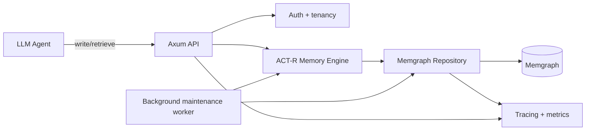
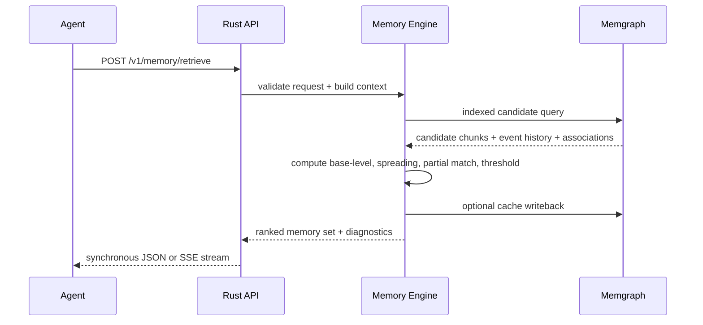

# ACT‑R Memory System for LLM Agents in Rust and Memgraph

## Executive summary

This handoff proposes an **ACT‑R–inspired declarative/procedural memory service** for LLM agents, implemented as a Rust service backed by Memgraph. The core recommendation is to model **chunks, buffer state, practice/retrieval events, associative links, and optional production rules** in Memgraph, while performing **exact activation computation and rule selection in Rust**. That split is the best engineering fit because ACT‑R activation depends on logarithms, power-law decay, noisy thresholds, associative spreading, and optional partial matching; Memgraph is excellent for indexed candidate generation, relationship traversal, persistence, and clustering, while Rust is a better execution environment for the numerical parts and API surface. Memgraph speaks Bolt/Cypher, supports composite indexes and uniqueness constraints, supports transactional storage with snapshot isolation by default, and can be used from Rust via its own Rust client guidance or a Bolt-compatible Rust driver such as `neo4rs`. citeturn19view3turn36view1turn5view1turn6view0turn6view2turn5view0turn32view2turn4search17

ACT‑R’s declarative memory can be operationalized as follows. A chunk’s activation is the sum of a **base-level term** and an **associative spreading term**:  
\[
A_i = B_i + \sum_j W_j S_{ji}
\]
with base-level learning  
\[
B_i = \ln\left(\sum_{k=1}^{n} t_k^{-d}\right)
\]
where \(t_k\) is time since each practice event and \(d\) is the decay parameter. Retrieval probability is logistic in relation to a threshold \(\tau\):  
\[
P(\text{retrieve } i) = \frac{1}{1 + e^{-(A_i-\tau)/s}}
\]
and retrieval latency is exponential in negative activation:  
\[
T_i = F e^{-A_i}
\]
with an empirically constrained relationship around threshold \(F \approx 0.35 e^{\tau}\). Production utility is  
\[
U_i = P_i G - C_i
\]
and production choice is softmax-like over utilities:  
\[
P(\text{choose } i)=\frac{e^{U_i/t}}{\sum_j e^{U_j/t}}
\]
ACT‑R also assumes module buffers expose limited information to a central production system; each buffer holds a single chunk, only one production fires per cycle, and a cognitive cycle is commonly treated as about **50 ms**. citeturn19view3turn18view6turn18view7turn36view1turn19view5turn25view1turn25view3

For an LLM agent, this yields a concrete design: use Memgraph to store **episodic and semantic chunks**, **practice/retrieval histories**, **associations** used for spreading activation, and **current buffer snapshots** for explainability. Expose a Rust API for `write_memory`, `update_memory`, `retrieve_memory`, `rehearse`, `consolidate`, and `forget`. Retrieval should be **two-stage**: first, indexed candidate selection in Memgraph by agent, chunk type, slot filters, and recency; second, exact ACT‑R scoring in Rust. In production, maintain a **cached base-level activation** on the chunk for fast ranking, and recompute exactly from event history during retrieval or scheduled consolidation. This hybrid design preserves ACT‑R semantics without forcing all numeric logic into Cypher. That recommendation is an engineering inference grounded in the ACT‑R equations and Memgraph’s strengths in indexed property-graph traversal and transactional graph storage. citeturn19view3turn24view0turn5view1turn34view0turn12search12

## ACT‑R essentials translated into implementable memory semantics

ACT‑R organizes cognition around **modules** that communicate through **buffers**, while a central **production system** selects one matching production at a time. The integrated ACT‑R account describes modules depositing chunks into buffers, the production system matching patterns over those buffers, one production firing per cycle, and each buffer holding only a single chunk at a time. In practice, for an LLM agent memory system, you usually do **not** need to reproduce the full cognitive architecture; you need to preserve the parts that affect retrieval and control. That means: represent chunks explicitly, represent buffer state explicitly, compute chunk activation from practice history and context, and implement production-rule selection over buffer summaries. citeturn25view1turn25view3

A **chunk** is the fundamental declarative unit. Engineering-wise, a chunk should have: a stable identifier; an owner or tenant; a chunk type; slot-value content; timestamps for creation and update; a practice history or compressed practice summary; protection flags; and optional provenance. ACT‑R’s formal retrieval model says chunk activation has a base-level term \(B_i\) and an associative term \(\sum_j W_jS_{ji}\). In the original integrated presentation, the attentional weights \(W_j\) are commonly set to \(1/n\) where \(n\) is the number of current sources, and associative strength can be approximated as \(S_{ji}=S-\ln(\text{fan}_j)\), where \(\text{fan}_j\) is the number of facts associated with cue \(j\). This is exactly why a graph database is attractive here: the **fan** of a cue is literally graph degree over a selected relationship family. citeturn19view3turn19view4

Base-level activation is the most important part to preserve faithfully. ACT‑R models practice and forgetting with  
\[
B_i = \ln\left(\sum_{k=1}^{n} t_k^{-d}\right)
\]
which produces the familiar power-law sensitivity to frequency and recency. Anderson and Schooler’s work is the theoretical basis for this, showing that environmental recurrence patterns match power-law recency/frequency effects and motivating ACT‑R’s rational memory formulation. In a software implementation, every **encoding, successful retrieval, rehearsal, or explicit reinforcement** should be treated as a practice event unless you intentionally distinguish event types with different weights. A robust default is \(d = 0.5\), which ACT‑R literature and the ACT‑R community have often used as a default over many applications. citeturn19view3turn2search1

Retrieval converts activation into both **success probability** and **latency**. The ACT‑R formulation is  
\[
P(\text{retrieve } i)=\frac{1}{1+e^{-(A_i-\tau)/s}}
\]
and  
\[
T_i = F e^{-A_i}
\]
where \(s\) controls activation noise and \(\tau\) is the retrieval threshold. In engineering terms, \(\tau\) becomes your **minimum activation threshold** for inclusion in the retrieval result set; \(s\) becomes a stochastic exploration knob; and \(F\) becomes a latency calibration parameter if you want the memory system to simulate human-like time or simply expose an expected retrieval delay metric. If you do not need stochasticity in production, you can set noise to zero for deterministic ranking while still preserving the same activation formula. citeturn19view3turn18view6turn18view7

ACT‑R implementations also support **partial matching**, which is highly relevant to LLM agents because agent prompts frequently provide incomplete or approximate cues. The standard tutorial material expresses activation with additional terms for spreading activation, noise, and partial matching:  
\[
A_i = B_i + \varepsilon_i + \sum_{k}\sum_j W_{kj}S_{ji} + \sum_l P M_{li}
\]
where \(P\) is the mismatch penalty weight and \(M_{li}\) is similarity between requested slot value \(l\) and the candidate chunk’s value for that slot. This is exactly the mechanism you want for “retrieve the most similar memory even if a slot is approximate.” In this system, treat exact symbolic slots as perfect-match / mismatch, and optionally add embedding-based similarity for free-text slots as a bounded value in \([MD, MS]\). That embedding integration is an engineering extension, not standard ACT‑R, but it maps cleanly to the mismatch term. citeturn24view0turn23search6

Procedural memory uses **production rules**. The ACT‑R utility equation is  
\[
U_i=P_iG-C_i
\]
and the probability of selecting a matching production is  
\[
P(\text{choose }i)=\frac{e^{U_i/t}}{\sum_j e^{U_j/t}}
\]
where \(G\) is current goal value, \(P_i\) is estimated probability of success, \(C_i\) is estimated cost, and \(t\) is utility noise. For an LLM agent, this is a natural fit for selecting among memory strategies, such as “retrieve exact episode,” “retrieve semantic summary,” “ask planner,” or “skip retrieval.” In the recommended design, store production rule metadata in Memgraph for observability and persistence, but execute rule matching and policy selection in Rust. citeturn36view1turn19view5

## Memgraph graph model, schema, constraints, and Cypher

Memgraph is a property graph database compatible with Bolt/Cypher. It does **not** create indexes automatically; it supports label indexes, label-property indexes, composite indexes, descending indexes, uniqueness constraints, existence constraints, and data-type constraints. It also supports runtime schema tracking via `SHOW SCHEMA INFO` when `--schema-info-enabled=true`, which is useful for validation and diagnostics in a memory platform. citeturn5view1turn6view0turn6view1turn34view0

### Recommended conceptual mapping

The recommended model is **hybrid symbolic graph + event graph**.

| ACT‑R construct | Memgraph representation | Rationale |
|---|---|---|
| Chunk | `(:Chunk)` node | Declarative unit with slots/properties and cached activation fields |
| Chunk type | `(:ChunkType)` node or `chunk_type` property | Use a property for speed; add node if type ontology matters |
| Buffer | `(:Buffer {buffer_name})` node | Explicitly snapshots current working state |
| Current buffer contents | `(:Buffer)-[:CURRENT]->(:Chunk)` | Explains why a chunk was retrieved or used |
| Source / cue for spreading activation | `(:Chunk)-[:ASSOCIATED_WITH {slot, weight, fan_cache?}]->(:Chunk)` | Supports cue-based traversal and fan effects |
| Practice / rehearsal / retrieval event | `(:PracticeEvent)` node | Exact base-level learning from event times; avoids hot-list appends |
| Production rule | `(:ProductionRule)` node | Optional persistence and scoring metadata |
| Agent / tenant | `(:Agent)` node | Isolation and multi-agent ownership |
| Episode / provenance | `(:Episode)` or `(:Source)` node | Groups writes and supports auditability |

This design is an engineering recommendation. It is not a literal ACT‑R software clone; it is a faithful operationalization of ACT‑R retrieval semantics on a property graph. The key design choice is to store **practice history as append-only event nodes**, not as a mutable timestamp list on the chunk. Under Memgraph’s snapshot isolation, concurrent updates to the same graph object can conflict; append-only events reduce write contention compared with repeatedly rewriting the same chunk node. citeturn6view2turn32view2

### Canonical schema

| Label / edge | Required properties | Suggested indexes / constraints | Notes |
|---|---|---|---|
| `:Agent` | `agent_id` | Unique on `agent_id` | Tenant boundary |
| `:Chunk` | `agent_id`, `chunk_id`, `chunk_type`, `slots`, `created_at`, `updated_at`, `active` | Composite unique on `(agent_id, chunk_id)`; index on `(agent_id, chunk_type)`; descending index on `(agent_id, last_practiced_at)`; optional nested indexes on hot slot paths such as `slots.topic` | `slots` is a MAP for flexible content; Memgraph supports indexes on nested map properties |
| `:Buffer` | `agent_id`, `buffer_name` | Composite unique on `(agent_id, buffer_name)` | Single current chunk per buffer enforced in app logic |
| `:PracticeEvent` | `event_id`, `agent_id`, `chunk_id`, `ts`, `kind`, `weight` | Unique on `event_id`; index on `(agent_id, ts)` | Append-only |
| `:ProductionRule` | `rule_id`, `agent_id`, `name`, `goal_value`, `successes`, `failures`, `estimated_cost_ms`, `enabled` | Composite unique on `(agent_id, rule_id)` | Optional if procedural memory is persisted |
| `:ASSOCIATED_WITH` | `slot`, `weight`, `created_at` | Optional edge-type/property indexes if edge-property-heavy workloads justify them | Edge-property indexes require `--storage-properties-on-edges=true` |
| `:CURRENT` | `set_at` | none | Only one outgoing current edge per buffer, controlled in tx |
| `:HAS_EVENT` | none | none | Simpler than inverse traversal if chunk-centric |

The constraint and index choices above are supported by Memgraph’s schema features: composite label-property indexes, descending indexes, uniqueness constraints over one or more properties, existence constraints, and type constraints. Memgraph also documents that constraints do **not** automatically create indexes, so create both explicitly. citeturn5view1turn6view0turn6view1turn27search0

### DDL and migration bootstrap

```cypher
CREATE CONSTRAINT ON (a:Agent) ASSERT a.agent_id IS UNIQUE;
CREATE CONSTRAINT ON (b:Buffer) ASSERT b.agent_id, b.buffer_name IS UNIQUE;
CREATE CONSTRAINT ON (c:Chunk) ASSERT c.agent_id, c.chunk_id IS UNIQUE;
CREATE CONSTRAINT ON (e:PracticeEvent) ASSERT e.event_id IS UNIQUE;
CREATE CONSTRAINT ON (p:ProductionRule) ASSERT p.agent_id, p.rule_id IS UNIQUE;

CREATE CONSTRAINT ON (c:Chunk) ASSERT EXISTS (c.agent_id);
CREATE CONSTRAINT ON (c:Chunk) ASSERT EXISTS (c.chunk_id);
CREATE CONSTRAINT ON (c:Chunk) ASSERT c.agent_id IS TYPED STRING;
CREATE CONSTRAINT ON (c:Chunk) ASSERT c.chunk_id IS TYPED STRING;
CREATE CONSTRAINT ON (c:Chunk) ASSERT c.active IS TYPED BOOLEAN;

CREATE INDEX ON :Chunk(agent_id, chunk_type);
CREATE INDEX ON :Chunk(agent_id, last_practiced_at) WITH CONFIG {"order": "DESC"};
CREATE INDEX ON :Chunk(agent_id, base_level_cache) WITH CONFIG {"order": "DESC"};
CREATE INDEX ON :PracticeEvent(agent_id, ts) WITH CONFIG {"order": "DESC"};
CREATE INDEX ON :Chunk(slots.topic);
CREATE INDEX ON :Chunk(slots.entity);
```

Memgraph supports these index and constraint families, including nested map-property indexes and descending indexes. For schema deployment, `schema.assert()` exists, but Memgraph documents that it is incomplete for some newer index families and that `DROP ALL CONSTRAINTS` / `DROP ALL INDEXES` are now preferred for full resets. Therefore, for this project, use **ordered `.cypher` migration files** applied by the Rust service rather than relying on a SQL migration tool such as `refinery`, which officially targets Postgres, MySQL, and SQLite rather than Bolt/Cypher backends. citeturn5view1turn34view1turn26search10turn31search0turn31search6

### CRUD and retrieval Cypher

**Create a chunk with initial practice event**

```cypher
MERGE (a:Agent {agent_id: $agent_id})
CREATE (c:Chunk {
  agent_id: $agent_id,
  chunk_id: $chunk_id,
  chunk_type: $chunk_type,
  slots: $slots,
  created_at: datetime(),
  updated_at: datetime(),
  active: true,
  first_practiced_at: datetime(),
  last_practiced_at: datetime(),
  practice_count: 1,
  decay_d: coalesce($decay_d, 0.5),
  retrieval_threshold: coalesce($retrieval_threshold, 0.0),
  base_level_cache: 0.0
})
MERGE (a)-[:OWNS]->(c)
CREATE (e:PracticeEvent {
  event_id: $event_id,
  agent_id: $agent_id,
  chunk_id: $chunk_id,
  ts: datetime(),
  kind: "encode",
  weight: 1.0
})
CREATE (c)-[:HAS_EVENT]->(e)
RETURN c;
```

**Read a chunk**

```cypher
MATCH (:Agent {agent_id: $agent_id})-[:OWNS]->(c:Chunk {chunk_id: $chunk_id})
WHERE c.active = true
RETURN c;
```

**Update chunk slots with optimistic versioning**

```cypher
MATCH (:Agent {agent_id: $agent_id})-[:OWNS]->(c:Chunk {chunk_id: $chunk_id})
WHERE c.active = true AND c.version = $expected_version
SET c.slots = $slots,
    c.updated_at = datetime(),
    c.version = c.version + 1
RETURN c;
```

**Soft-delete a chunk**

```cypher
MATCH (:Agent {agent_id: $agent_id})-[:OWNS]->(c:Chunk {chunk_id: $chunk_id})
SET c.active = false,
    c.deleted_at = datetime(),
    c.updated_at = datetime()
RETURN c.chunk_id AS deleted_chunk_id;
```

**Associate two chunks for spreading activation**

```cypher
MATCH (src:Chunk {agent_id: $agent_id, chunk_id: $src_chunk_id, active: true})
MATCH (dst:Chunk {agent_id: $agent_id, chunk_id: $dst_chunk_id, active: true})
MERGE (src)-[r:ASSOCIATED_WITH {slot: $slot}]->(dst)
SET r.weight = $weight,
    r.updated_at = datetime(),
    r.created_at = coalesce(r.created_at, datetime())
RETURN r;
```

**Fast retrieval by cached activation**

```cypher
MATCH (:Agent {agent_id: $agent_id})-[:OWNS]->(c:Chunk)
WHERE c.active = true
  AND ($chunk_type IS NULL OR c.chunk_type = $chunk_type)
  AND ($topic IS NULL OR c.slots.topic = $topic)
  AND c.base_level_cache >= $min_base_level
RETURN c
ORDER BY c.base_level_cache DESC, c.last_practiced_at DESC
LIMIT $candidate_limit;
```

**Context-aware spreading activation prefetch**

```cypher
MATCH (ctx:Chunk {agent_id: $agent_id, chunk_id: $context_chunk_id, active: true})
MATCH (ctx)-[r:ASSOCIATED_WITH]->(cand:Chunk {agent_id: $agent_id, active: true})
WHERE ($chunk_type IS NULL OR cand.chunk_type = $chunk_type)
RETURN cand.chunk_id AS chunk_id,
       sum(coalesce(r.weight, 0.0)) AS spread_score
ORDER BY spread_score DESC
LIMIT $candidate_limit;
```

**Exact retrieval candidate fetch for Rust re-ranking**

```cypher
MATCH (:Agent {agent_id: $agent_id})-[:OWNS]->(c:Chunk)
WHERE c.active = true
  AND ($chunk_type IS NULL OR c.chunk_type = $chunk_type)
OPTIONAL MATCH (c)-[:HAS_EVENT]->(e:PracticeEvent)
WHERE e.kind IN ["encode", "retrieve", "rehearse"]
RETURN c, collect({ts: e.ts, kind: e.kind, weight: e.weight}) AS practice_events
LIMIT $candidate_limit;
```

The design intent is to let Memgraph do **candidate selection** and neighborhood expansion, while Rust computes exact ACT‑R activation and then writes back `base_level_cache`, `last_activation`, and `activation_updated_at` as a maintenance optimization. citeturn5view1turn34view0turn36view1

## Rust service architecture and LLM integration API

The Rust stack should be intentionally conservative: `tokio` for async runtime, `axum` for HTTP API and SSE / WebSockets, `serde` and `serde_json` for serialization, `thiserror` for typed domain errors, `tower-http` plus `tracing` / `tracing-subscriber` for observability, `neo4rs` as the primary async Bolt driver, and `testcontainers` + `criterion` for integration and performance testing. Tokio provides the async runtime foundation; axum integrates with Tokio and exposes SSE/WebSocket support via crate features; Serde provides efficient trait-based serialization; `thiserror` reduces boilerplate for typed errors; `tower-http::trace` supplies request tracing middleware; `neo4rs` exposes connection pooling and transactions in async Rust; and `testcontainers` / `criterion` are the standard choices for containerized integration tests and statistically rigorous microbenchmarks. citeturn9search0turn9search3turn29view0turn30search3turn30search1turn9search2turn9search22turn30search10turn32view0turn33view2turn11search0turn11search1

### Recommended crate layout

| Crate / module | Responsibility |
|---|---|
| `memory-domain` | Chunk, activation, production, buffer, API DTOs, validation |
| `memory-store` | Memgraph repository layer, query text, transaction helpers |
| `memory-engine` | ACT‑R algorithms, scoring, rehearsal, consolidation, forgetting |
| `memory-api` | Axum routes, auth middleware, streaming endpoints |
| `memory-worker` | Scheduled jobs for cache refresh, consolidation, forgetting, backups |
| `memory-migrations` | Ordered embedded `.cypher` files and migration runner |
| `memory-bench` | Criterion benchmarks and synthetic load harness |

### Architecture



### Data flow for retrieval



### Storage and transaction guidance

Use `neo4rs::Graph` as the default store abstraction. Its docs state that `Graph::run` / `Graph::execute` borrow a connection from an internal pool and return it immediately, while explicit transactions reuse the same connection until commit/rollback and drop. The config builder exposes `max_connections`, with a documented default of 16. That is a good default for a single-node service, but for high-throughput memory writes, start with a tuned pool size per replica and validate using contention and latency measurements. citeturn32view0

Use these transaction patterns:

| Operation | Pattern |
|---|---|
| Single chunk read | auto-commit query |
| Chunk write + initial event + buffer update | explicit transaction |
| Rehearsal append event only | explicit transaction, no chunk rewrite if possible |
| Consolidation merge | explicit transaction; lock by deterministic chunk ordering |
| Retrieval | auto-commit read tx; optional separate async cache writeback |
| Forget batch | paginated explicit transactions |

For error handling, prefer a domain error enum such as `MemoryError` with variants for validation, not found, conflict, threshold miss, driver error, and serialization error; implement it with `thiserror`; convert to HTTP problem details in the API crate. Use `tracing` spans around every request and Memgraph query; enrich spans with `agent_id`, `chunk_id`, `buffer_name`, query class, and transaction id if available. Memgraph also supports transaction metadata visibility through `SHOW TRANSACTIONS`, which is useful if the driver can attach metadata. citeturn9search2turn30search10turn5view3

### API surface for LLM agents

| Endpoint | Method | Purpose | Sync / stream |
|---|---|---|---|
| `/v1/memory/chunks` | `POST` | Create chunk | Sync |
| `/v1/memory/chunks/{chunk_id}` | `GET` | Read chunk | Sync |
| `/v1/memory/chunks/{chunk_id}` | `PATCH` | Update chunk | Sync |
| `/v1/memory/chunks/{chunk_id}` | `DELETE` | Soft-delete chunk | Sync |
| `/v1/memory/retrieve` | `POST` | Ranked retrieval | Sync |
| `/v1/memory/retrieve/stream` | `POST` | Progressive retrieval diagnostics + results | SSE |
| `/v1/memory/rehearse` | `POST` | Append practice event | Sync |
| `/v1/memory/consolidate` | `POST` | Merge / summarize near-duplicate chunks | Sync, usually admin/internal |
| `/v1/memory/forget` | `POST` | Apply forgetting policy | Sync, usually admin/internal |
| `/v1/memory/buffers/{buffer_name}` | `PUT` | Set current buffer chunk | Sync |
| `/v1/memory/productions/evaluate` | `POST` | Optional procedural selection over buffer state | Sync |
| `/healthz` | `GET` | Liveness | Sync |
| `/readyz` | `GET` | Readiness with Memgraph probe | Sync |

Suggested retrieve request:

```json
{
  "agent_id": "agent-123",
  "chunk_type": "episodic",
  "slot_filters": {"topic": "memgraph", "entity": "ACT-R"},
  "context_chunk_ids": ["ck_1", "ck_9"],
  "now": "2026-06-23T12:00:00Z",
  "candidate_limit": 200,
  "result_limit": 12,
  "activation_threshold": 0.25,
  "decay_override": null,
  "noise_s": 0.0,
  "partial_matching": true,
  "mismatch_penalty": 0.5,
  "context_window_tokens": 2500,
  "return_diagnostics": true
}
```

Suggested retrieve response:

```json
{
  "agent_id": "agent-123",
  "results": [
    {
      "chunk_id": "ck_12",
      "chunk_type": "episodic",
      "slots": {"topic": "memgraph", "entity": "ACT-R"},
      "activation": 1.84,
      "base_level": 1.22,
      "spread": 0.51,
      "partial_match": 0.11,
      "expected_latency_ms": 57
    }
  ],
  "diagnostics": {
    "candidates_examined": 84,
    "threshold": 0.25,
    "noise_s": 0.0,
    "context_window_tokens": 2500
  }
}
```

The streaming endpoint should emit candidate batches or retrieval phases over SSE: `candidate_batch`, `scored_candidate`, `ranked_result`, `done`. Axum supports SSE and WebSockets behind feature flags and is a good fit for this interface style. citeturn29view0turn9search3

### Example Rust code snippets

**Domain activation function**

```rust
use std::time::{Duration, SystemTime};

#[derive(Debug, Clone)]
pub struct PracticeEvent {
    pub at: SystemTime,
    pub weight: f64, // default 1.0
}

#[derive(Debug, Clone)]
pub struct ActivationInput {
    pub now: SystemTime,
    pub decay_d: f64,
    pub threshold: f64,
    pub noise_s: f64,
    pub latency_factor_ms: f64,
    pub base_events: Vec<PracticeEvent>,
    pub spread_score: f64,
    pub partial_match_score: f64,
}

#[derive(Debug, Clone)]
pub struct ActivationOutput {
    pub base_level: f64,
    pub activation: f64,
    pub retrieval_probability: f64,
    pub expected_latency_ms: f64,
}

pub fn compute_activation(input: &ActivationInput) -> ActivationOutput {
    let eps = 1e-6_f64;

    let base_sum = input
        .base_events
        .iter()
        .map(|ev| {
            let age = input
                .now
                .duration_since(ev.at)
                .unwrap_or(Duration::from_secs(0))
                .as_secs_f64()
                .max(eps);
            ev.weight * age.powf(-input.decay_d)
        })
        .sum::<f64>()
        .max(eps);

    let base_level = base_sum.ln();
    let activation = base_level + input.spread_score + input.partial_match_score;

    let retrieval_probability =
        1.0 / (1.0 + (-(activation - input.threshold) / input.noise_s.max(eps)).exp());

    let expected_latency_ms = input.latency_factor_ms * (-activation).exp();

    ActivationOutput {
        base_level,
        activation,
        retrieval_probability,
        expected_latency_ms,
    }
}
```

**Memgraph query with `neo4rs`**

```rust
use neo4rs::{query, Graph};
use serde::{Deserialize, Serialize};

#[derive(Debug, Clone, Serialize, Deserialize)]
pub struct ChunkCandidate {
    pub chunk_id: String,
    pub chunk_type: String,
    pub slots_json: String,
    pub base_level_cache: f64,
}

pub async fn fetch_candidates(
    graph: &Graph,
    agent_id: &str,
    chunk_type: Option<&str>,
    limit: i64,
) -> Result<Vec<ChunkCandidate>, neo4rs::Error> {
    let cypher = r#"
        MATCH (:Agent {agent_id: $agent_id})-[:OWNS]->(c:Chunk)
        WHERE c.active = true
          AND ($chunk_type IS NULL OR c.chunk_type = $chunk_type)
        RETURN c.chunk_id AS chunk_id,
               c.chunk_type AS chunk_type,
               toString(c.slots) AS slots_json,
               coalesce(c.base_level_cache, 0.0) AS base_level_cache
        ORDER BY c.last_practiced_at DESC
        LIMIT $limit
    "#;

    let mut result = graph
        .execute(
            query(cypher)
                .param("agent_id", agent_id)
                .param("chunk_type", chunk_type.map(|s| s.to_string()))
                .param("limit", limit),
        )
        .await?;

    let mut out = Vec::new();
    while let Some(row) = result.next().await? {
        out.push(ChunkCandidate {
            chunk_id: row.get("chunk_id")?,
            chunk_type: row.get("chunk_type")?,
            slots_json: row.get("slots_json")?,
            base_level_cache: row.get("base_level_cache")?,
        });
    }
    Ok(out)
}
```

The driver and crate choices above are consistent with the documented Rust ecosystem pieces and Memgraph’s own Rust guidance. Memgraph explicitly says its Rust guide is based on `rsmgclient` and that Bolt-compatible Neo4j drivers can be used because Memgraph is compatible with them; `neo4rs` documents async transactions, connection pooling, and configurable pool size. citeturn5view0turn32view0turn33view2

## Algorithms for activation, rehearsal, consolidation, and forgetting

### Exact activation computation

Use the exact ACT‑R formulation over practice events.

```text
function score_chunk(chunk, events, context_cues, params, now):
    base_sum = 0
    for ev in events:
        age = max(now - ev.ts, epsilon)
        base_sum += ev.weight * age^(-params.decay_d)
    base_level = ln(max(base_sum, epsilon))

    spread = 0
    for cue in context_cues:
        fan = max(cue.out_degree_or_cached_fan, 1)
        S_ji = params.max_assoc_strength - ln(fan)
        W_j = cue.attentional_weight
        spread += W_j * S_ji

    partial = 0
    if params.partial_matching:
        for requested_slot in retrieval_request.slots:
            similarity = similarity_fn(requested_slot.value, chunk.slot_value(requested_slot.key))
            partial += params.mismatch_penalty * similarity

    activation = base_level + spread + partial
    retrieval_probability = 1 / (1 + exp(-(activation - params.threshold) / params.noise_s))
    expected_latency = params.latency_factor * exp(-activation)

    return activation, retrieval_probability, expected_latency
```

**Complexity:**  
For a single chunk, exact scoring is \(O(m + c + q)\), where \(m\) is practice-event count, \(c\) is number of context cues, and \(q\) is number of requested slots entering partial matching. For \(N\) candidates, complexity is \(O(\sum m_i + N(c+q))\). This is why the service should use **candidate pruning** in Memgraph first. The formulas themselves are directly derived from ACT‑R sources. citeturn19view3turn24view0

### Rehearsal and cache maintenance

```text
function rehearse(chunk_id, event_kind, now):
    begin tx
      insert PracticeEvent(chunk_id, ts=now, kind=event_kind, weight=1.0)
      update Chunk.last_practiced_at = now
      update Chunk.practice_count += 1
    commit

    schedule async:
      recompute base_level_cache for chunk_id
```

**Complexity:** \(O(1)\) in the write path if exact cache recomputation is deferred; \(O(m)\) if recomputed immediately from all events.

**Recommendation:** keep the write path short and append-only, then refresh `base_level_cache` asynchronously during low latency budgets or batch windows. This is a pragmatic adaptation to Memgraph transaction contention and the cost of exact recomputation. citeturn6view2turn32view2

### Consolidation

Consolidation is not a single canonical ACT‑R equation, but it is an appropriate engineering extension for LLM memory systems. Use it to convert repeated, overlapping episodic chunks into semantic summaries.

```text
function consolidate(agent_id, chunk_type, window):
    candidates = fetch recent active chunks for agent_id and chunk_type
    groups = cluster by semantic_hash OR high slot overlap OR same entity/topic
    for each group with size >= threshold:
        summary = summarize group into semantic chunk
        create summary chunk
        create ASSOCIATED_WITH edges from summary to source chunks
        mark sources consolidated=true
```

**Complexity:** with bucketing by `semantic_hash` or `(entity, topic)` prefix, near \(O(n \log n)\) for grouping; without bucketing, all-pairs similarity can degrade to \(O(n^2)\). Use coarse bucketing first.

### Forgetting

```text
function forget(agent_id, now, policy):
    candidates = fetch chunks where active=true and protected=false
                 and last_practiced_at < policy.recency_cutoff
                 and base_level_cache < policy.base_level_cutoff

    for chunk in candidates:
        if chunk.link_count == 0 or policy.allow_orphan_forget:
            soft_delete(chunk)
        else:
            archive(chunk)
```

**Complexity:** \(O(k)\) over filtered candidates if indexed by `last_practiced_at`, `base_level_cache`, and `active`.

A safe production rule is: first **soft-delete**, then **purge archived chunks** after a retention window. Because Memgraph stores durability via snapshots and WAL, retention and purge need to be aligned with backup policy rather than assumed to disappear immediately from physical media. citeturn13view1turn7search9

### Production-rule selection

```text
function choose_production(matching_rules, goal_value, noise_t):
    scores = []
    for rule in matching_rules:
        utility = rule.success_prob * goal_value - rule.estimated_cost
        scores.append(utility)

    if noise_t == 0:
        return argmax(scores)

    return sample_softmax(scores, temperature=noise_t)
```

**Complexity:** \(O(r)\) for \(r\) matching rules.

This directly mirrors ACT‑R’s utility and production choice equations and is appropriate for routing among retrieval plans, summarization decisions, or tool-use policies. citeturn36view1turn19view5

## Concurrency, consistency, scaling, security, and operations

Memgraph’s default transactional mode is `IN_MEMORY_TRANSACTIONAL`; default isolation is `SNAPSHOT_ISOLATION`, which guarantees a consistent snapshot for reads and aborts conflicting concurrent updates on the same graph objects. That is good for memory workloads, but it means you should avoid hot-node rewrite patterns. Therefore: prefer **append-only practice events**, use **optimistic version fields** on chunks, and add **bounded retry with jitter** for `409 Conflict` / transaction-conflict failures. For purely read-only analytics, `READ COMMITTED` can reduce some contention tradeoffs, but the recommended default for this memory service is to stay with snapshot isolation and explicit retries. citeturn6view2turn6view3

For clustering, distinguish **Community replication** from **Enterprise high availability**. Memgraph’s HA architecture uses coordinators managed with Raft; a typical HA cluster is **3 coordinators plus 3 data instances** (1 MAIN + 2 REPLICAs), while the minimum valid HA setup is **3 coordinators plus 2 data instances**. Writes go only to MAIN; read scaling is achieved by adding REPLICAs; write scaling is primarily vertical on MAIN rather than horizontal sharding. Querying the cluster in HA uses `neo4j://` Bolt+routing through coordinators, which returns routing tables with reader/writer/router roles and a documented TTL of 5 minutes. citeturn14search2turn35view1turn35view2

That has two architectural consequences. First, if you choose `neo4rs`, treat routing support as an item requiring explicit verification in your compatibility matrix, because `neo4rs` documents routing support behind an unstable feature and notes incomplete Bolt feature coverage. Second, if HA routing compatibility is uncertain for your chosen driver version, the simplest fallback is an **application-side topology adapter**: route writes to MAIN, route reads to REPLICAs, and refresh topology from a coordinator-side health source. This is an engineering mitigation based on the documented state of `neo4rs` and Memgraph’s client-side routing model. citeturn33view2turn35view2

For privacy and security, use the following baseline:

| Concern | Recommendation | Basis |
|---|---|---|
| Transport encryption | Enable Bolt TLS with `--bolt-cert-file` and `--bolt-key-file` | Memgraph documents SSL/TLS for encrypted Bolt connections citeturn13view2 |
| Authentication | Use named users; in Enterprise use roles and database-specific roles for tenant isolation | Memgraph documents auth, roles, and multi-tenant role assignment citeturn13view3turn8search2 |
| Tenant isolation | Prefer one database per tenant for Enterprise multi-tenancy or strict `agent_id` scoping in Community | Memgraph recommends treating the default `memgraph` DB as admin/system and storing app data elsewhere in multi-tenant setups citeturn13view3 |
| Secrets | Keep DB credentials and API keys in secret manager; use `secrecy`-style handling in Rust | Engineering best practice |
| Sensitive slot values | Optional application-side field encryption or redaction before persistence | Engineering recommendation; Memgraph docs cover transport/auth, not full application-level field secrecy |
| Retention | Align soft delete, purge windows, snapshots, and WAL retention with policy | Memgraph durability is snapshot + WAL based citeturn13view1turn7search9 |

Operationally, enable monitoring early. Memgraph exposes metrics for vertex/edge count, memory usage, disk usage, index counts, transaction counters, query latency histograms, sessions, and HA status; OpenMetrics can be scraped directly, and Memgraph also supports session trace in logs for detailed per-session query profiling. These are the right primitives for a memory service dashboard. citeturn13view0

Recommended monitoring set:

| Metric | Why it matters |
|---|---|
| `memory_retrieve_latency_ms` p50/p95/p99 | User-visible retrieval quality |
| `memory_candidates_examined` | Detect poor pruning |
| `memory_activation_compute_ms` | Numerical scoring cost |
| `memory_write_conflicts_total` | Snapshot-isolation contention |
| `memory_rehearsal_events_total` | Growth / hot-agent patterns |
| `memgraph_vertex_count`, `memgraph_edge_count` | Dataset growth citeturn13view0 |
| `memgraph_memory_res_bytes`, `memgraph_disk_usage_bytes` | Capacity pressure citeturn13view0 |
| `memgraph_query_execution_latency_seconds` | DB-side latency citeturn13view0 |
| `memgraph_rolled_back_transactions_total` | Contention / failure rates citeturn13view0 |
| `memgraph_instance_is_alive`, `memgraph_instance_is_main` | HA health in Enterprise citeturn13view0 |

For durability, keep WAL enabled, keep periodic snapshots enabled, and back up via `CREATE SNAPSHOT` plus persistent volumes or managed backup workflows. Memgraph explicitly requires snapshots when WAL is enabled and retains WAL files only after the latest snapshot boundary. citeturn13view1turn7search9

## Delivery plan, tests, benchmarks, and implementation handoff

### Implementation tasks and rough effort

The user asked for estimated effort without an externally specified team size, so the table below is a **rough single-engineer estimate** for an initial production-capable service.

| Workstream | Scope | Rough effort |
|---|---|---|
| ACT‑R core model | Activation engine, partial matching, production scoring, policy defaults | 4–6 engineer-days |
| Schema and migrations | Labels, constraints, indexes, `.cypher` migrator, seed tooling | 3–4 engineer-days |
| Repository layer | Memgraph queries, transaction helpers, retries, error mapping | 4–6 engineer-days |
| API layer | CRUD, retrieve, stream, rehearse, consolidate, forget, health endpoints | 4–6 engineer-days |
| Maintenance workers | Cache refresh, consolidation, forgetting, metrics jobs | 3–5 engineer-days |
| Test harness | Unit, integration, deterministic fixtures, conflict tests | 5–7 engineer-days |
| Performance and benchmark suite | Criterion microbenches, load tests, candidate-pruning validation | 3–5 engineer-days |
| Security and deployment | TLS, auth, config, secrets, CI/CD, observability | 3–5 engineer-days |
| HA / cluster validation | Enterprise routing validation, failover tests, runbooks | 3–6 engineer-days |

### Unit and integration test cases

| Test case | Type | Expected outcome |
|---|---|---|
| Base-level activation with one event | Unit | Matches analytical value `ln(t^-d)` |
| Base-level activation with multiple events | Unit | Matches `ln(sum(t_k^-d))` within tolerance |
| Retrieval probability thresholding | Unit | Monotonic increase as activation rises |
| Latency monotonicity | Unit | Higher activation yields lower expected latency |
| Partial matching penalty | Unit | Similar chunks outrank dissimilar chunks when base-level equal |
| Production utility ranking | Unit | Higher `P_i G - C_i` wins when noise is zero |
| Chunk create/read/update/delete | Integration | CRUD semantics preserved |
| Rehearsal append under concurrency | Integration | No lost events; bounded retries succeed |
| Retrieval with context associations | Integration | Context-linked chunks get higher spread score |
| Consolidation of duplicate episodes | Integration | Summary chunk created; source chunks linked/flagged |
| Forgetting policy run | Integration | Soft-delete only eligible chunks |
| Migration idempotency | Integration | Re-running migrations is safe |
| Snapshot and restart recovery | Integration | Persisted graph recovers correctly |
| HA read/write routing | Integration | Writes reach MAIN, reads succeed after failover |

Use `testcontainers` with a `memgraph/memgraph` image for CI integration tests. Testcontainers for Rust is explicitly built for throwaway dependency containers in tests; Memgraph’s Docker-first developer workflow aligns well with that. citeturn11search0turn11search6turn5view0

### CI/CD outline

A practical pipeline:

1. `cargo fmt --check`
2. `cargo clippy --all-targets -- -D warnings`
3. `cargo test --lib`
4. integration tests with Memgraph container
5. `cargo bench` for Criterion smoke benchmarks on main branches
6. build container image
7. run schema migration dry run against ephemeral Memgraph
8. deploy to staging
9. synthetic retrieval tests and conflict tests
10. promote to production

Criterion is designed for statistics-driven benchmarking and regression detection; use it for the activation engine and repository hot paths. citeturn11search1turn11search5

### Interfaces to hand to a coding agent

The coding agent should implement these Rust traits first:

```rust
pub trait MemoryRepository {
    async fn create_chunk(&self, req: CreateChunk) -> Result<Chunk, MemoryError>;
    async fn get_chunk(&self, agent_id: &str, chunk_id: &str) -> Result<Option<Chunk>, MemoryError>;
    async fn update_chunk(&self, req: UpdateChunk) -> Result<Chunk, MemoryError>;
    async fn soft_delete_chunk(&self, agent_id: &str, chunk_id: &str) -> Result<(), MemoryError>;
    async fn append_practice_event(&self, req: PracticeEventWrite) -> Result<(), MemoryError>;
    async fn fetch_candidates(&self, req: CandidateQuery) -> Result<Vec<ChunkWithHistory>, MemoryError>;
    async fn upsert_association(&self, req: AssociationWrite) -> Result<(), MemoryError>;
    async fn set_buffer_current(&self, req: BufferSetCurrent) -> Result<(), MemoryError>;
}

pub trait ActivationEngine {
    fn score_candidates(&self, req: RetrieveRequest, candidates: Vec<ChunkWithHistory>) -> Vec<ScoredChunk>;
}

pub trait MaintenanceJobs {
    async fn refresh_activation_cache(&self, agent_id: &str) -> Result<JobReport, MemoryError>;
    async fn consolidate(&self, req: ConsolidateRequest) -> Result<JobReport, MemoryError>;
    async fn forget(&self, req: ForgetRequest) -> Result<JobReport, MemoryError>;
}
```

### Open questions and limitations

A few design questions remain implementation-sensitive rather than theory-sensitive.

First, **driver choice for HA** should be validated in your exact environment. Memgraph’s HA routing model is clear, and `neo4rs` documents routing support behind an unstable feature; if HA is mandatory on day one, treat this as a compatibility checkpoint, not an assumption. citeturn35view2turn33view2

Second, there is a tradeoff between **exact event-history scoring** and **cached activation scoring**. Exact ACT‑R scoring is theoretically cleaner; cached scoring is operationally faster. The recommended compromise is **indexed candidate fetch + exact Rust re-rank + async cache writeback**.

Third, this handoff assumes **no specific LLM** and therefore keeps episodic/semantic chunk content model-agnostic. If your target LLM has strict tool-calling or token-budget behavior, you may want a second pass that tunes the retrieval API and consolidation heuristics for that model family.

The primary sources used here are the original ACT‑R literature and manuals, Memgraph documentation, and Rust crate documentation for the recommended implementation stack. citeturn19view3turn36view1turn17view2turn2search1turn5view0turn5view1turn6view0turn34view0turn13view0turn13view1turn13view2turn13view3turn35view2turn9search0turn9search3turn30search3turn32view0